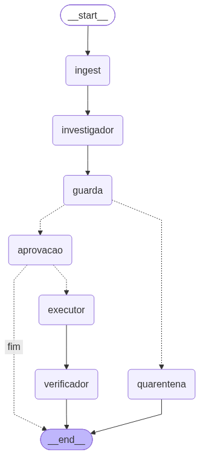

# 🧭 Venditus

> **Corrige o catálogo pela voz do cliente. E sabe quando não corrigir.**

*Venditus* — do latim, "vendido". O que o catálogo deixa de dizer, o cliente já disse.

Hackathon **deco — Agents for Commerce** · 2026

---

## 🎯 O problema

**O catálogo não fala a língua do cliente.** Isso gera dois sintomas que ninguém conecta:

**🔍 Antes da compra** — o cliente busca *"tênis impermeável"*. A loja **tem** o produto, mas a palavra só existe no texto livre da descrição, não como atributo estruturado. A busca retorna zero. Ele sai calado, e a loja nunca fica sabendo que perdeu a venda.

**📦 Depois da compra** — o cliente compra uma air fryer 220V porque a página não informava a voltagem. Devolve. Semana que vem, outro cliente cai no mesmo buraco.

É **o mesmo defeito de atributo**, visto de dois lados.

---

## 💡 A ideia

Existem dois sinais na loja, e cada um enxerga metade do problema.

#### 🔍 A busca mostra **onde** está o dinheiro — mas não mostra a verdade

340 pessoas procuraram *"tênis impermeável"* e não acharam nada. Você sabe que tem venda parada ali, e sabe quanto vale.

O que a busca **não** sabe: se o tênis é mesmo impermeável. Isso ela só pode inferir da descrição — um texto escrito pelo marketing.

#### 📦 A devolução mostra a **verdade** — mas não mostra o tamanho

Oito pessoas que compraram a capa de chuva escreveram que ela molha. Isso é fato, dito por quem usou o produto.

O que a devolução **não** sabe: quantas vendas estão sendo perdidas por causa disso, nem onde procurar a próxima. São oito pessoas, e a informação chega 30 dias depois da compra.

#### 🧩 Sozinho, cada sinal leva a uma decisão errada

A busca sozinha manda marcar **os dois** produtos como impermeáveis — e um deles não é.
A devolução sozinha nunca conta que existe uma venda perdida esperando ser recuperada.

Juntos, eles permitem uma coisa que nenhum dos dois faz separado: **distinguir uma correção de uma mentira.**

### O exemplo que define o produto

Dois produtos na prateleira. A diferença entre eles é invisível no catálogo:

- **`SKU-4471` — Tênis Trilha Alpha** · tem membrana impermeável de verdade · descrição menciona · atributo **vazio**
- **`SKU-8802` — Capa de Chuva Nimbus** · só repele garoa, encharca em chuva forte · descrição menciona · atributo **vazio**

Sinal de entrada:

```
"tênis impermeável"          340 buscas/mês   →  0 resultados
"capa de chuva impermeável"  128 buscas/mês   →  0 resultados
```

**Para o diagnóstico, os dois casos são idênticos.** Produto existe, descrição sustenta o termo, atributo faltando, busca falha. Mesma causa, mesma proposta de correção.

O que os separa está no pós-venda:

| | 🥾 SKU-4471 | 🧥 SKU-8802 |
|---|---|---|
| Devoluções em 90 dias | 3 | 11 |
| Falando de água | **0** | **8** |
| Decisão do agente | ✅ **escreve** | 🛑 **recusa** |
| Resultado | busca passa de 0 → 1 produto | vai para qualidade, **nada é escrito** |

### 🛑 O que uma ferramenta de busca faria

**Exatamente a mesma coisa nos dois.** Ela vê dois termos com zero resultado e dois produtos cujo texto menciona impermeabilidade. Aplica nos dois — porque **a informação que a impediria de aplicar no segundo não existe no mundo dela.**

Trinta dias depois: o zero-results caiu, o dashboard dela está verde, a capa começou a vender para quem queria impermeável de verdade, e as devoluções subiram — no P&L da **logística**, não no da busca. Ninguém liga uma coisa à outra.

> **Os dois casos entram idênticos no sistema. Só um deveria sair escrito.
> A diferença só existe se você ler os dois lados.**

---

## 🧠 Como funciona


Sete nós, **dois com LLM** (`investigador` e `guarda`). Os outros cinco são determinísticos — não colocamos modelo onde não é preciso.

O grafo acima é o desenho. Abaixo, o **mesmo grafo renderizado pelo próprio objeto compilado** — não é ilustração, é o que roda:

<p align="center">
  
</p>

Repare na bifurcação depois do `guarda`: é o único ponto do grafo com duas saídas, e é o produto inteiro. Regenere com `python scripts/gerar_diagrama.py`.

**A aresta `guarda → quarentena` é o produto.** Quando o pós-venda contradiz a correção proposta, o caminho até a escrita simplesmente **não existe** — não é uma sugestão ao modelo, é topologia do grafo.

E nada é escrito sem **aprovação humana**. A escrita mora num nó posterior ao ponto de interrupção e é idempotente, porque retomar de uma pausa re-executa o nó inteiro.

---

## 📊 O que ele mede

| KPI | Demonstrável ao vivo |
|---|---|
| 🔍 Taxa de busca sem resultado | ✅ `0 → 1` na hora |
| 🏷️ Cobertura de atributo | ✅ na hora |
| 💰 Receita recuperada (estimada) | ✅ `volume × conversão × ticket médio` |
| 🛡️ **Taxa de bloqueio do guarda** | ✅ **a métrica do diferencial** |
| 📉 Taxa de devolução por SKU | ⏳ 30 dias — afirmado, não demonstrado |

A **taxa de bloqueio** é a única métrica que nenhum concorrente consegue calcular: ela só existe porque os dois sinais estão no mesmo motor.

### 📈 Os números do problema

| | |
|---|---|
| Buscas sem resultado | **6,3%** mesmo com search avançado |
| Quem usa busca | 1/3 dos visitantes, **40–60% da receita** |
| Abandono após busca falha | **1/3 sai na hora** |
| Sites que tratam zero-results como beco sem saída | **68%** (Baymard, 325 sites) |
| Custo real de devolução no Brasil | até **30% acima** do valor reembolsado |
| Ticket médio brasileiro | **R$ 564,96** (ABComm 2026) |

---

## 🚀 Rodando

**Requisitos:** Python **3.12** · Node **22+**

> ⚠️ Use `python`, não `py` — o launcher aponta para 3.14, que ainda não tem
> wheel para várias dependências e te joga numa compilação de C sem motivo.

Há três níveis, do mais barato ao mais completo. **O nível 2 já roda a demo
inteira** — Shopify é opcional.

---

### Nível 0 — os testes · nenhuma chave, nenhuma internet

```powershell
cd back
python -m venv .venv
.\.venv\Scripts\pip.exe install -e ".[dev]"
.\.venv\Scripts\python.exe -c "import venditus"   # tem que passar sem erro
.\.venv\Scripts\pytest.exe -v
```

<details>
<summary>macOS / Linux</summary>

```bash
cd back
python3 -m venv .venv
./.venv/bin/pip install -e ".[dev]"
./.venv/bin/python -c "import venditus"
./.venv/bin/pytest -v
```
</details>

**78 testes, sem rede e sem chave de API.** O catálogo e o LLM têm dublês.

Os dois que provam a tese, se quiser ir direto ao ponto:

```powershell
.\.venv\Scripts\pytest.exe -v -k "caminho_bloqueado or idempotente"
```

| teste | o que prova |
|---|---|
| `test_caminho_bloqueado_nao_escreve` | o guarda impede a escrita quando o pós-venda contradiz |
| `test_executor_e_idempotente` | retomar a aprovação não duplica a escrita |

> ⚠️ Se `import venditus` falhar com `ModuleNotFoundError`, a instalação
> editável quebrou em silêncio. Rode
> `.\.venv\Scripts\pip.exe install -e . --force-reinstall --no-deps` e confirme
> que surgiu `_editable_impl_venditus.pth` em `.venv/Lib/site-packages`.
> O sintoma engana: o `pytest` continua passando e todo o resto falha.

---

### Nível 1 — a demo pelo terminal · só a chave da OpenAI

Crie `back/.env`:

```env
OPENAI_API_KEY=sk-...
```

**Sem credenciais da Shopify o projeto usa o catálogo em memória
automaticamente** — e ele já contém os dois produtos do caso. Não precisa de
loja nenhuma.

```powershell
cd back
.\.venv\Scripts\python.exe scripts\rodar_demo.py
```

Roda os dois casos ponta a ponta e imprime o veredito. Custa centavos.

---

### Nível 2 — a interface · a demo completa

**Terminal 1 — backend:**

```powershell
cd back
.\.venv\Scripts\langgraph.exe dev --no-browser --port 2024
```

**Terminal 2 — front:**

```powershell
cd front
npm install
npm run dev
```

Abra **`http://localhost:5173`**. É a única URL que você abre — o front fala
com o backend por um proxy, então não há CORS para configurar.

<details>
<summary>macOS / Linux — backend</summary>

```bash
cd back
./.venv/bin/langgraph dev --no-browser --port 2024
```
</details>

> ⚠️ Chame sempre o `langgraph` **de dentro do venv**. Se houver um `langgraph`
> global no PATH, o servidor sobe no Python errado, responde `200` em `/ok`, e
> só quebra quando um run executa — com um `ModuleNotFoundError` que não diz
> qual módulo.

#### O que clicar

| # | ação | o que deve acontecer |
|---|---|---|
| 1 | **tênis impermeável** → *Aprovar* | os seis passos acendem; a busca vai de **0 → 1** |
| 2 | **capa de chuva impermeável** | o passo *"Audita as devoluções"* fica **vermelho** e os seguintes são riscados; aparecem **as 11 devoluções** que o guarda leu |
| 3 | olhe os indicadores no topo | **1 de 2 correções recusadas** |

Cada caso leva de 40 a 90 segundos — são dois nós de LLM com raciocínio, e o
contador de segundos na tela mostra o tempo correndo.

#### Testes do front

```powershell
cd front
npm test        # 30 testes, funções puras
```

---

### Nível 3 — contra uma loja Shopify real *(opcional)*

Acrescente ao `back/.env`:

```env
SHOPIFY_STORE_DOMAIN=sua-loja.myshopify.com
SHOPIFY_ADMIN_TOKEN=shpat_...
SHOPIFY_API_VERSION=2026-07
```

```powershell
.\.venv\Scripts\python.exe scripts\semear_shopify.py      # cria os produtos
.\.venv\Scripts\python.exe scripts\verificar_shopify.py   # prova o ciclo
```

Entre uma execução e outra, devolva o SKU-4471 ao estado "antes" **e reinicie o
servidor** — o adapter guarda em memória as correções já aplicadas:

```powershell
.\.venv\Scripts\python.exe scripts\verificar_shopify.py --resetar
```

---

### Outros comandos

| | |
|---|---|
| `python scripts/avaliar_classificador.py` | mede a acurácia do classificador (20/20 hoje) |
| `python scripts/gerar_diagrama.py` | regenera o diagrama da arquitetura |
| `node front/scripts/sonda-sdk.mjs` | confere o contrato do SDK contra o backend, sem navegador |

---

## ⚖️ O que é real e o que é sintético

Distinção que sustentamos em todo lugar:

| real | sintético |
|---|---|
| o grafo, os dois nós de LLM e o raciocínio | o corpus de buscas sem resultado (`seed.py`) |
| a escrita no catálogo, idempotente | o corpus de devoluções (`seed.py`) |
| a medição antes/depois da busca | a estimativa em R$ (premissas declaradas) |
| a decisão de recusa | — |

**Não há integração com analytics nem com pós-venda.** O conector é trabalho de
encanamento; o que foi construído aqui é o motor que decide quando *não*
escrever.

### Limitação conhecida

O guarda só protege produto que **já teve devolução**. Para um item sem
histórico, o segundo sinal não existe e o veto não tem com o que trabalhar —
o terceiro termo da fila (`mochila cargueira 80 litros`) demonstra isso: a loja
não vende 80 litros, a causa correta seria sortimento, e o investigador
diagnostica errado sem que nada possa barrá-lo.

---

## 🗂️ Estrutura

```
back/                # 🐍 o agente
  src/venditus/
    models.py        # 🧾 as seis causas, diagnóstico, decisão do guarda
    estimate.py      # 💰 estimativa de perda em R$
    fixid.py         # 🔒 identificador determinístico (idempotência)
    metrics.py       # 📊 KPIs agregados
    state.py         # 🧬 estado que percorre o grafo
    nodes.py         # ⚙️ os sete nós
    graph.py         # 🕸️ montagem do StateGraph
    seed.py          # 🌱 catálogo e devoluções do demo
    avaliacao.py     # 🎯 conjunto rotulado para medir o classificador
    adapters/
      base.py        # 🔌 protocolo CatalogAdapter
      fake.py        # 🧪 catálogo em memória
      shopify.py     # 🛒 Shopify Admin GraphQL
  scripts/           # 🧰 demo, seed, verificação, diagrama, avaliação
  tests/             # ✅ 78 testes, sem rede
front/               # ⚛️ a interface
  src/
    dados/           # 🧬 contrato do estado e o espelho declarado do back
    logica/          # 🧮 passos, indicadores e formatação — testados
    ganchos/         # 🪝 usarExecucao, embrulhando o useStream
    componentes/     # 🎨 as telas, com a recusa no centro
  scripts/           # 🔎 sonda da superfície do SDK
  HANDOFF.md         # 📋 tudo que o dev de front precisa saber
docs/                # 📚 spec, plano e diagrama
```

A lógica de domínio **não conhece HTTP nem Shopify**. Trocar por VTEX é implementar o protocolo `CatalogAdapter` — nenhum nó muda.

---

## 🛠️ Stack

| | |
|---|---|
| 🕸️ Orquestração | **LangGraph** (Python) + checkpointer SQLite |
| 🤖 Modelo | **GPT-5.6 Terra** nos dois nós de LLM |
| 🧾 Saída tipada | Pydantic via `with_structured_output()` |
| 🛒 Catálogo | Shopify Admin GraphQL, atrás de adapter |
| ⚛️ Front | **React + Vite + `useStream`** + Tailwind v4 |

---

## 📚 Documentos

| | |
|---|---|
| 📐 [Design](docs/superpowers/specs/2026-08-09-venditus-mvp-design.md) | o quê, por quê, escopo, riscos |
| 🗺️ [Plano de implementação](docs/superpowers/plans/2026-08-09-venditus-backend.md) | 15 tarefas em TDD |
| 🤖 [AGENTS.md](AGENTS.md) | decisões inegociáveis para agentes |
| 📋 [front/HANDOFF.md](front/HANDOFF.md) | contrato, paleta e telas para quem faz o front |
| 🎨 [Design do front](docs/superpowers/specs/2026-08-09-venditus-front-design.md) | telas, nomenclatura e as lacunas do contrato |
| 🗺️ [Plano do front](docs/superpowers/plans/2026-08-09-venditus-front.md) | 16 tarefas |

---

## 🚧 Escopo

**Nesta rodada:** o loop completo busca → catálogo, com o corpus de devolução alimentando o nó guarda.

**Fora, e declarado:** caminho de escrita pós-venda → PDP · camada de lote e anomalia regional · adapter VTEX · agendamento · tema light do front · responsivo mobile.

O motor tem **dois leitores desenhados e um construído**. O guarda prova que o segundo sinal está ligado.

---

<sub>🌱 Dados do demo são sintéticos. Estimativas de R$ são premissas declaradas, não medições.</sub>
