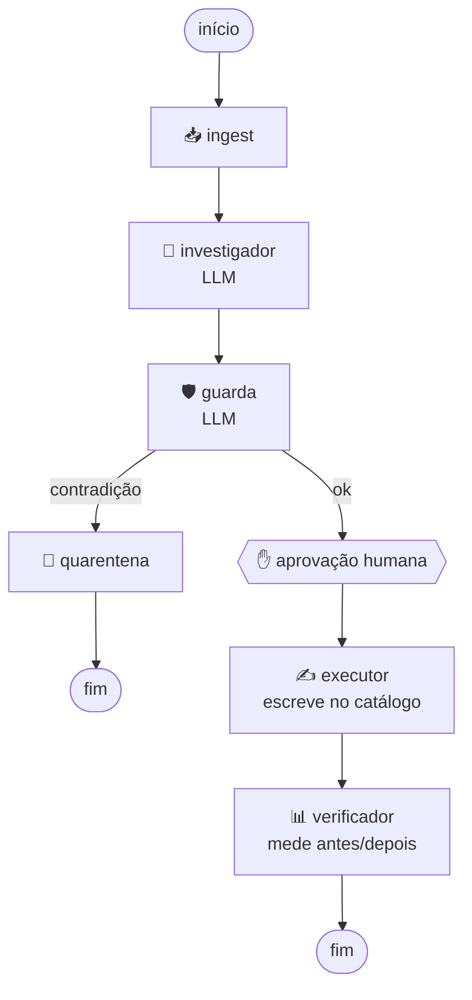

# 🧭 Venditus

> **Corrige o catálogo pela voz do cliente. E sabe quando não corrigir.**

*Venditus* — do latim, "vendido". O que o catálogo deixa de dizer, o cliente já disse.

Hackathon **deco — Agents for Commerce** · 2026

---

## 🎯 O problema

**O catálogo não fala a língua do cliente.** Isso gera dois sintomas que ninguém conecta:

**🔍 Antes da compra** — o cliente busca *"tênis impermeável"*. A loja **tem** o produto, mas a palavra só existe no texto livre da descrição, não como atributo estruturado. A busca retorna zero. Ele sai calado, e a loja nunca fica sabendo que perdeu a venda.

**📦 Depois da compra** — o cliente compra uma air fryer 220V porque a página não informava a voltagem. Devolve. Semana que vem, outro cliente cai no mesmo buraco.

É **o mesmo defeito de atributo**, visto de dois lados.

---

## 💡 A ideia

Existem dois sinais na loja, e cada um enxerga metade do problema.

#### 🔍 A busca mostra **onde** está o dinheiro — mas não mostra a verdade

340 pessoas procuraram *"tênis impermeável"* e não acharam nada. Você sabe que tem venda parada ali, e sabe quanto vale.

O que a busca **não** sabe: se o tênis é mesmo impermeável. Isso ela só pode inferir da descrição — um texto escrito pelo marketing.

#### 📦 A devolução mostra a **verdade** — mas não mostra o tamanho

Oito pessoas que compraram a capa de chuva escreveram que ela molha. Isso é fato, dito por quem usou o produto.

O que a devolução **não** sabe: quantas vendas estão sendo perdidas por causa disso, nem onde procurar a próxima. São oito pessoas, e a informação chega 30 dias depois da compra.

#### 🧩 Sozinho, cada sinal leva a uma decisão errada

A busca sozinha manda marcar **os dois** produtos como impermeáveis — e um deles não é.
A devolução sozinha nunca conta que existe uma venda perdida esperando ser recuperada.

Juntos, eles permitem uma coisa que nenhum dos dois faz separado: **distinguir uma correção de uma mentira.**

### O exemplo que define o produto

Dois produtos na prateleira. A diferença entre eles é invisível no catálogo:

- **`SKU-4471` — Tênis Trilha Alpha** · tem membrana impermeável de verdade · descrição menciona · atributo **vazio**
- **`SKU-8802` — Capa de Chuva Nimbus** · só repele garoa, encharca em chuva forte · descrição menciona · atributo **vazio**

Sinal de entrada:

```
"tênis impermeável"          340 buscas/mês   →  0 resultados
"capa de chuva impermeável"  128 buscas/mês   →  0 resultados
```

**Para o diagnóstico, os dois casos são idênticos.** Produto existe, descrição sustenta o termo, atributo faltando, busca falha. Mesma causa, mesma proposta de correção.

O que os separa está no pós-venda:

| | 🥾 SKU-4471 | 🧥 SKU-8802 |
|---|---|---|
| Devoluções em 90 dias | 3 | 11 |
| Falando de água | **0** | **8** |
| Decisão do agente | ✅ **escreve** | 🛑 **recusa** |
| Resultado | busca passa de 0 → 1 produto | vai para qualidade, **nada é escrito** |

### 🛑 O que uma ferramenta de busca faria

**Exatamente a mesma coisa nos dois.** Ela vê dois termos com zero resultado e dois produtos cujo texto menciona impermeabilidade. Aplica nos dois — porque **a informação que a impediria de aplicar no segundo não existe no mundo dela.**

Trinta dias depois: o zero-results caiu, o dashboard dela está verde, a capa começou a vender para quem queria impermeável de verdade, e as devoluções subiram — no P&L da **logística**, não no da busca. Ninguém liga uma coisa à outra.

> **Os dois casos entram idênticos no sistema. Só um deveria sair escrito.
> A diferença só existe se você ler os dois lados.**

---

## 🧠 Como funciona



Sete nós, **dois com LLM** (`investigador` e `guarda`). Os outros cinco são determinísticos.

**A aresta `guarda → quarentena` é o produto.** Quando o pós-venda contradiz a correção proposta, o caminho até a escrita simplesmente **não existe** — não é uma sugestão ao modelo, é topologia do grafo.

E nada é escrito sem **aprovação humana**. A escrita mora num nó posterior ao ponto de interrupção e é idempotente, porque retomar de uma pausa re-executa o nó inteiro.

---

## 📊 O que ele mede

| KPI | Demonstrável ao vivo |
|---|---|
| 🔍 Taxa de busca sem resultado | ✅ `0 → 1` na hora |
| 🏷️ Cobertura de atributo | ✅ na hora |
| 💰 Receita recuperada (estimada) | ✅ `volume × conversão × ticket médio` |
| 🛡️ **Taxa de bloqueio do guarda** | ✅ **a métrica do diferencial** |
| 📉 Taxa de devolução por SKU | ⏳ 30 dias — afirmado, não demonstrado |

A **taxa de bloqueio** é a única métrica que nenhum concorrente consegue calcular: ela só existe porque os dois sinais estão no mesmo motor.

### 📈 Os números do problema

| | |
|---|---|
| Buscas sem resultado | **6,3%** mesmo com search avançado |
| Quem usa busca | 1/3 dos visitantes, **40–60% da receita** |
| Abandono após busca falha | **1/3 sai na hora** |
| Sites que tratam zero-results como beco sem saída | **68%** (Baymard, 325 sites) |
| Custo real de devolução no Brasil | até **30% acima** do valor reembolsado |
| Ticket médio brasileiro | **R$ 564,96** (ABComm 2026) |

---

## 🚀 Rodando

```bash
cd back
python -m venv .venv
.venv\Scripts\pip install -e ".[dev]"
.venv\Scripts\python -c "import venditus"   # tem que passar sem erro
.venv\Scripts\pytest -v
```

> ⚠️ Use `python`, não `py` — o launcher aponta para 3.14, que ainda não tem wheel para várias dependências.
>
> ⚠️ Se `import venditus` falhar, a instalação editável quebrou em silêncio (o `pytest` continua passando e todo o resto falha). Rode `.venv\Scripts\pip install -e . --force-reinstall --no-deps`.

**Toda a suíte roda sem chave de API e sem internet.** O catálogo e o LLM têm dublês.

Servidor do grafo, com Swagger em `/docs` e visualização dos nós no LangGraph Studio:

```bash
.venv\Scripts\langgraph dev
```

Para rodar de verdade, crie um `back/.env`:

```env
OPENAI_API_KEY=sk-...

# Opcionais — sem eles o projeto usa o catálogo em memória
SHOPIFY_STORE_DOMAIN=sua-loja.myshopify.com
SHOPIFY_ADMIN_TOKEN=shpat_...
SHOPIFY_API_VERSION=...
```

Gerar o diagrama da arquitetura:

```bash
.venv\Scripts\python scripts\gerar_diagrama.py
```

---

## 🗂️ Estrutura

```
back/                # 🐍 o agente
  src/venditus/
    models.py        # 🧾 as seis causas, diagnóstico, decisão do guarda
    estimate.py      # 💰 estimativa de perda em R$
    fixid.py         # 🔒 identificador determinístico (idempotência)
    metrics.py       # 📊 KPIs agregados
    state.py         # 🧬 estado que percorre o grafo
    nodes.py         # ⚙️ os sete nós
    graph.py         # 🕸️ montagem do StateGraph
    seed.py          # 🌱 catálogo e devoluções do demo
    avaliacao.py     # 🎯 conjunto rotulado para medir o classificador
    adapters/
      base.py        # 🔌 protocolo CatalogAdapter
      fake.py        # 🧪 catálogo em memória
      shopify.py     # 🛒 Shopify Admin GraphQL
  scripts/           # 🧰 demo, seed, verificação, diagrama, avaliação
  tests/             # ✅ 78 testes, sem rede
front/               # ⚛️ a interface
  src/
    dados/           # 🧬 contrato do estado e o espelho declarado do back
    logica/          # 🧮 passos, indicadores e formatação — testados
    ganchos/         # 🪝 usarExecucao, embrulhando o useStream
    componentes/     # 🎨 as telas, com a recusa no centro
  scripts/           # 🔎 sonda da superfície do SDK
  HANDOFF.md         # 📋 tudo que o dev de front precisa saber
docs/                # 📚 spec, plano e diagrama
```

A lógica de domínio **não conhece HTTP nem Shopify**. Trocar por VTEX é implementar o protocolo `CatalogAdapter` — nenhum nó muda.

---

## 🛠️ Stack

| | |
|---|---|
| 🕸️ Orquestração | **LangGraph** (Python) + checkpointer SQLite |
| 🤖 Modelo | **GPT-5.6 Terra** nos dois nós de LLM |
| 🧾 Saída tipada | Pydantic via `with_structured_output()` |
| 🛒 Catálogo | Shopify Admin GraphQL, atrás de adapter |
| ⚛️ Front | **React + Vite + `useStream`** + Tailwind v4 |

---

## 📚 Documentos

| | |
|---|---|
| 📐 [Design](docs/superpowers/specs/2026-08-09-venditus-mvp-design.md) | o quê, por quê, escopo, riscos |
| 🗺️ [Plano de implementação](docs/superpowers/plans/2026-08-09-venditus-backend.md) | 15 tarefas em TDD |
| 🤖 [AGENTS.md](AGENTS.md) | decisões inegociáveis para agentes |
| 📋 [front/HANDOFF.md](front/HANDOFF.md) | contrato, paleta e telas para quem faz o front |
| 🎨 [Design do front](docs/superpowers/specs/2026-08-09-venditus-front-design.md) | telas, nomenclatura e as lacunas do contrato |
| 🗺️ [Plano do front](docs/superpowers/plans/2026-08-09-venditus-front.md) | 16 tarefas |

---

## 🚧 Escopo

**Nesta rodada:** o loop completo busca → catálogo, com o corpus de devolução alimentando o nó guarda.

**Fora, e declarado:** caminho de escrita pós-venda → PDP · camada de lote e anomalia regional · adapter VTEX · agendamento · tema light do front · responsivo mobile.

O motor tem **dois leitores desenhados e um construído**. O guarda prova que o segundo sinal está ligado.

---

<sub>🌱 Dados do demo são sintéticos. Estimativas de R$ são premissas declaradas, não medições.</sub>
