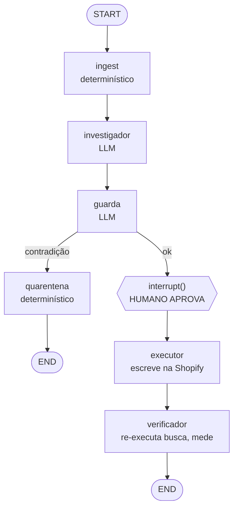

# Venditus — Design do MVP

**Data:** 2026-08-09
**Contexto:** Hackathon deco "Agents for Commerce"
**Orçamento:** 20h totais, projeto greenfield

---

## Context

Guilherme compete no hackathon `hackathon.decocms.com/agents-for-commerce`, avaliado em cinco critérios: Impacto no Negócio (com métrica), Execução Técnica (incluindo arquitetura), Originalidade, Aplicabilidade Real e Apresentação.

Três ideias discutidas convergiram para um motor único. A pesquisa de mercado mostrou que cada peça isolada já tem concorrente — o espaço vazio está no **loop fechado** (escrever no catálogo + verificar o efeito) e na **fusão de sinal pré-venda com pós-venda**.

Restrição dominante: **20 horas**, nada construído, incluindo a produção do vídeo. Todo o desenho abaixo é subordinado a isso.

---

## 1. Tese

**O catálogo não fala a língua do cliente.** Isso gera dois sintomas que ninguém conecta:

- **Pré-venda:** o cliente busca "tênis impermeável". A loja tem o produto, mas o termo só existe no texto livre da descrição, não como atributo estruturado. Busca retorna zero. Ele sai calado.
- **Pós-venda:** o cliente compra 220V sem a página informar. Devolve. O próximo cliente repete.

É o mesmo defeito de atributo, visto de dois lados.

### O diferencial

Cada sinal enxerga metade do problema:

**A busca mostra onde está o dinheiro, mas não mostra a verdade.** 340 pessoas
procuraram "tênis impermeável" e não acharam — dá para saber que há venda parada e
quanto vale. O que a busca não sabe é se o tênis é mesmo impermeável; isso ela só
infere da descrição, escrita pelo marketing.

**A devolução mostra a verdade, mas não mostra o tamanho.** Oito pessoas que
compraram a capa escreveram que ela molha — fato, dito por quem usou. Mas são oito
pessoas, com 30 dias de atraso, e nada disso indica onde procurar a próxima venda
perdida.

**Sozinho, cada sinal leva a uma decisão errada.** A busca sozinha manda marcar os
dois produtos como impermeáveis, e um deles não é. A devolução sozinha nunca revela
que há receita esperando ser recuperada.

Juntar os dois cria uma capacidade que nenhum lado tem sozinho: **distinguir uma correção de uma mentira.**

### O exemplo que define o produto

Dois produtos na prateleira. A diferença entre eles é invisível no catálogo:

- **`SKU-4471` — Tênis Trilha Alpha.** Tem membrana impermeável de verdade. Descrição: *"membrana impermeável que mantém os pés secos na trilha"*. Atributo `impermeavel` **vazio**.
- **`SKU-8802` — Capa de Chuva Leve Nimbus.** Descrição: *"tecido leve com repelência à água para o dia a dia"*. Atributo `impermeavel` **vazio**. Na prática segura garoa e encharca em chuva forte.

Sinal de entrada:

```
"tênis impermeável"          340 buscas/mês    0 resultados
"capa de chuva impermeável"  128 buscas/mês    0 resultados
```

**Para o investigador os dois casos são idênticos:** produto existe, descrição menciona impermeabilidade, atributo faltando, busca falha. Mesmo diagnóstico, mesma proposta.

**Caso 1 — escreve.** O guarda puxa as devoluções do SKU-4471: 3 em 90 dias, duas por tamanho e uma por cor. Nenhuma menciona água. → permitir. Aprovado, escrito, busca passa de 0 para 1 produto em estoque.

**Caso 2 — recusa.** O guarda puxa as devoluções do SKU-8802: 11 em 90 dias, **8 falam de água** — *"chovi 10 minutos e encharquei"*, *"não é impermeável, é repelente"*. → bloquear. Nenhuma escrita acontece; vai para quarentena como hipótese de qualidade.

**O que uma ferramenta de busca faz nos dois: exatamente a mesma coisa.** Ela aplica nos dois casos, porque a informação que a impediria de aplicar no segundo não existe no mundo dela. Trinta dias depois o zero-results caiu, o dashboard dela está verde, e as devoluções da capa subiram no P&L da logística — sem ninguém ligar uma coisa à outra.

> **Os dois casos entram idênticos no sistema. Só um deveria sair escrito. A diferença só existe se você ler os dois lados.**

### Posicionamento competitivo

| Concorrente | O que faz | Onde para |
|---|---|---|
| VTEX Intelligent Synonyms | resolve o bucket de sinônimo | não toca atributo nem categorização |
| ReturnRadar (Shopify, abr/2026) | classifica motivo de devolução por SKU | **não escreve** — lojista aplica na mão |
| Revuze eComm Hub | sugere melhoria de PDP a partir de review | sugere; não aplica nem verifica |
| Loop / Returnless | triagem da devolução ocorrida | escreve no **pedido**, não no **produto** |

Ninguém fecha o loop nem cruza pré com pós-venda.

---

## 2. Escopo do MVP

### Dentro

- Loop completo **busca → catálogo**: ingestão, classificação de causa, proposta, aprovação humana, escrita na Shopify, re-execução da busca, quantificação em R$.
- Corpus de devolução usado **exclusivamente** para alimentar o nó guarda (detecção de contradição).
- Dashboard com quatro KPIs.
- Grafo visualizável no LangGraph Studio.

### Fora — explicitamente

- **Caminho de escrita pós-venda → PDP.** O motor tem dois leitores desenhados; **um construído**. O guarda prova que o segundo sinal está ligado; a correção de PDP a partir de devolução é o passo seguinte, não este.
- **Camada de lote / anomalia temporal e regional** (casos B e C do documento Venditus). É a parte mais original e a menos demonstrável — exige rastreio de lote por pedido, que o Shopify não fornece. Fica como narrativa de pitch, não como código.
- Adapter VTEX (interface preparada, implementação não).
- Cron/agendamento, autenticação, deploy, multi-loja.

**Justificativa do corte de cron:** um agendamento não acrescenta nada ao vídeo e tira o controle de timing na gravação. Vira um botão "Rodar agora".

---

## 3. Arquitetura



São **seis nós, dos quais dois usam LLM** (`investigador` e `guarda`). Os outros quatro — `ingest`, `quarentena`, `executor`, `verificador` — são determinísticos. A descrição honesta é: dois nós de raciocínio, quatro determinísticos, um ponto de interrupção humana. Não chamar isso de "seis agentes".

**A aresta `guarda --> quarentena` é o produto.** Ela existe no diagrama e é apontável no vídeo.

### Requisito arquitetural: idempotência

Quando o grafo retoma de um `interrupt()`, **o nó inteiro re-executa desde o início.** Consequência vinculante:

> Toda escrita e toda chamada cobrada precisa estar em um nó **posterior** ao `interrupt()`, e ser idempotente.

É por isso que `executor` é um nó separado. Colapsá-lo no investigador produz escrita duplicada no catálogo — ao vivo, durante a gravação.

O `executor` grava um `fix_id` determinístico (hash de `sku + campo + valor`) e verifica antes de escrever.

---

## 4. Stack

| Camada | Escolha | Versão / detalhe |
|---|---|---|
| Linguagem | Python | backend |
| Orquestração | LangGraph | checkpointer SQLite |
| LLM | `gpt-5.6-terra` | ambos os nós; endpoint **Chat Completions** (não Responses API — não listada como suportada) |
| Integração LLM | `langchain-openai` | **>= 1.4.1** (abaixo disso `reasoning_effort` é engolido em silêncio) |
| Saída tipada | `with_structured_output()` + Pydantic | Terra suporta `structured_outputs` nativamente |
| Catálogo | Shopify Admin GraphQL | via `httpx` |
| Front | React + `useStream` | `@langchain/langgraph-sdk/react` — trata interrupts nativamente |
| Arquitetura visível | **`draw_mermaid_png()`** — entregável comprometido | gera do grafo compilado; sem servidor, sem chave, sem internet |
| Arquitetura visível (upgrade) | LangGraph Studio — **opcional** | `langgraph dev` → UI em `smith.langchain.com/studio/?baseUrl=http://127.0.0.1:2024`. Exige **chave do LangSmith**, internet e navegador Chromium. Suporte a Windows não é documentado explicitamente. O app desktop descontinuado era o de macOS — irrelevante aqui |

### Configuração do modelo

```python
# langchain-openai >= 1.4.1
ChatOpenAI(
    model="gpt-5.6-terra",
    reasoning_effort="medium",   # "high" no nó guarda
    # SEM temperature, SEM top_p
)
```

**Não passar `temperature`.** Em modelos GPT-5.x de raciocínio, `temperature`/`top_p` são aceitos apenas com `reasoning_effort: none`; com outros níveis a chamada erra. Não confirmado na página do 5.6, mas contornável a custo zero — o controle correto é `reasoning_effort`. O risco real é copiar um exemplo de LangGraph que passa `temperature=0` por padrão.

**Modelo único nos dois nós** é decisão deliberada: a demo custa centavos, então escolher modelo por custo seria otimização prematura que arrisca qualidade. Subir para `gpt-5.6-sol` no guarda apenas se ele errar nos testes.

O trecho de catálogo é prefixo estável — usar prompt caching (input em cache a $0,20/1M vs $2/1M).

---

## 5. Componentes

Estrutura de diretórios:

```
graph/
  state.py          # TypedDict do estado que percorre o grafo
  nodes/
    ingest.py       # carrega buscas sem resultado
    investigador.py # classifica causa + propõe correção
    guarda.py       # checa contradição no pós-venda
    quarentena.py   # registra para qualidade, encerra
    executor.py     # escreve na Shopify (idempotente)
    verificador.py  # re-executa busca, mede antes/depois
  build.py          # monta o StateGraph, arestas, checkpointer
adapters/
  types.py          # interface CatalogAdapter
  shopify.py        # implementação
seed/
  catalog.py        # catálogo com defeitos plantados
  searches.py       # log de busca sintético
  returns.py        # textos de devolução
web/                # React + useStream
```

| Componente | O que faz | Depende de |
|---|---|---|
| `ingest` | Lê o log de busca sem resultado, ordena por R$ estimado perdido | `seed/searches.py` |
| `investigador` | Recebe query + contexto de catálogo. Devolve `{causa, confiança, evidência, correção_proposta}` validado por Pydantic | LLM, adapter (leitura) |
| `guarda` | Recebe a correção proposta + textos de devolução do SKU. Decide `permitir` ou `bloquear` com justificativa | LLM, `seed/returns.py` |
| `quarentena` | Registra o caso como hipótese de qualidade, encerra o fluxo | estado |
| `executor` | Aplica a correção via Admin GraphQL. Idempotente por `fix_id` | adapter (escrita) |
| `verificador` | Re-executa a query, captura antes/depois, calcula R$ | adapter (leitura) |

`graph/nodes/` não conhece HTTP nem Shopify diretamente — recebe dados, devolve decisão. É o que torna testável em segundos e o que sobreviveria a uma troca para VTEX.

### As 6 causas (enum Pydantic)

`typo` · `sinonimo` · `atributo_ausente` · `categorizacao_errada` · `sem_estoque` · `sem_sortimento`

As duas últimas **não geram escrita** — sinalizam reposição e compras, respectivamente.

---

## 6. Dados semeados

- **Catálogo:** ~30 produtos, sendo 12 com "impermeável" apenas em texto livre.
- **Log de busca:** termos com volume plausível, incluindo `tênis impermeável` (340 buscas/mês) e `capa de chuva impermeável` (128 buscas/mês), ambos com zero resultado.
- **Armadilha do guarda:** `SKU-8802` (Capa de Chuva Leve Nimbus) — atributo `impermeavel` **vazio, igual ao tênis**, descrição mencionando "repelência à água", e **8 de 11 devoluções em 90 dias falando de água**. O diagnóstico do investigador tem que sair idêntico ao do caso legítimo; só o guarda separa os dois.
- **Contraprova:** `SKU-4471` (Tênis Trilha Alpha) — 3 devoluções em 90 dias, nenhuma sobre água. É o caso que **deve** ser escrito.

O dataset é sintético e isso é assumido abertamente no pitch.

---

## 7. KPIs

Todo KPI de resultado tem 30 dias de atraso. Com dado sintético e 20h, taxa de devolução não é demonstrável. Dois níveis, **declarados como tal**:

### Nível 1 — demonstrado na tela

| KPI | Por que funciona |
|---|---|
| **Taxa de busca sem resultado** | Move na hora: `0 → 12 produtos`. KPI-herói |
| **Cobertura de atributo** | % de SKUs com o atributo preenchido. Move na hora |
| **R$ recuperado (estimado)** | `volume de buscas × taxa de conversão assumida × ticket médio`. Fórmula visível na tela, rótulo "estimativa" |
| **Taxa de bloqueio do guarda** | % de propostas recusadas por contradição |
| **Acurácia da classificação** | contra ~20 queries rotuladas à mão |

### Nível 2 — afirmado, não demonstrado

- Taxa de devolução por SKU (30d antes vs. depois)
- Motivos de devolução por SKU

A **taxa de bloqueio do guarda** é a métrica do diferencial: nenhum concorrente consegue calculá-la, porque nenhum tem os dois sinais no mesmo motor.

**Parâmetros da estimativa** (configuráveis, exibidos na tela junto do número):

- `taxa de conversão assumida`: **2%** — valor conservador para tráfego de busca; declarado como premissa, não medido
- `ticket médio`: **R$ 564,96** (ABComm 2026), sobrescrevível por categoria

### Dashboard

Layout com **números ilustrativos** — os valores reais saem da execução:

```
┌──────────────────────┬──────────────────────┐
│ BUSCAS SEM RESULTADO │  R$ RECUPERADO       │
│   6,3% → 2,1%        │  R$ 84.200 (estim.)  │
├──────────────────────┼──────────────────────┤
│ COBERTURA DE ATRIB.  │  BLOQUEADOS P/ GUARDA│
│   41% → 88%          │  3 de 14             │
└──────────────────────┴──────────────────────┘
```

Os dois de cima vendem para o lojista; os dois de baixo, para o jurado.

### Números de mercado para o pitch

6,3% de buscas sem resultado mesmo com search avançado · quem usa busca é 1/3 dos visitantes e gera 40–60% da receita · 1/3 abandona imediatamente após busca falha · 68% dos sites tratam zero-results como beco sem saída (Baymard, 325 sites) · devolução custa até 30% acima do valor reembolsado (BR) · ticket médio BR R$ 564,96 (ABComm).

---

## 8. Tratamento de erro

| Falha | Comportamento |
|---|---|
| LLM devolve fora do schema | `with_structured_output()` valida; em falha, o item vai para revisão manual em vez de escrever |
| Shopify API erra na escrita | Nó falha explicitamente; estado marcado, item volta para a fila. Nunca marcar como aplicado sem confirmação |
| Re-execução após `interrupt()` | `fix_id` determinístico impede escrita duplicada |
| Sem chave de API | Falha na inicialização com mensagem clara, não no meio do demo |
| Rate limit | Backoff simples; a demo tem ~20 queries, o teto não deve ser atingido |

---

## 9. Testes

- **Por nó:** `investigador` e `guarda` testados isoladamente com entradas fixas. `guarda` precisa ter um teste que **bloqueia** — é o caminho crítico.
- **Classificador:** avaliado contra ~20 queries rotuladas à mão. Produz o número de acurácia citável no pitch.
- **Idempotência:** rodar o mesmo `fix_id` duas vezes não duplica escrita nem infla o contador de R$.
- **End-to-end:** `langgraph dev`, disparar o grafo, confirmar que os nós percorrem na ordem esperada e que o interrupt pausa.
- **Prova do resultado:** `tênis impermeável feminino` retorna 0 antes e ≥1 produto em estoque depois, com o diff do metafield visível no admin da Shopify.

---

## 10. Roteiro do demo

Seis beats. Todo componente existe para servir um deles.

1. **Painel.** Buscas sem resultado ordenadas por R$ perdido. `tênis impermeável — 340 buscas — R$ 3.842/mês estimados` (340 × 2% × R$ 564,96)
2. **Diagnóstico.** `Causa: atributo ausente. SKU-4471 tem "membrana impermeável" na descrição e o atributo estruturado vazio.` Com o trecho como evidência.
3. **Aprovação.** Escreve o metafield. Diff visível no admin.
4. **Verificação.** `0 resultados → 1 produto em estoque`. Contador de R$ sobe.
5. **A virada.** Próximo item: `capa de chuva impermeável — 128 buscas — R$ 1.446/mês`. **Diagnóstico idêntico** — mesmo tipo de causa, mesma proposta. E o agente **para**: *"Bloqueado. 8 de 11 devoluções em 90 dias dizem que molha. Aplicar aumentaria devolução. Encaminhado para qualidade."*
6. **Fecho.** *"A ferramenta de busca teria aplicado. Ela não olha devolução."*

O beat 5 é o pitch. Os outros cinco dão contexto a ele.

**Duas superfícies no vídeo:** LangGraph Studio para o beat de arquitetura (grafo vivo, aresta do guarda acendendo); UI própria para os beats de dinheiro.

---

## 11. Orçamento

| Etapa | Horas |
|---|---|
| Setup (Shopify dev store + catálogo semeado + projeto Python + LangGraph) | 3–4h |
| Grafo e nós | 6–7h |
| UI React com `useStream` | 2–3h |
| Vídeo e pitch | 3–5h |
| **Total** | **14–19h** de 20h |

Sem folga para retrabalho.

---

## 12. Riscos

| Risco | Mitigação |
|---|---|
| Jurado conhece VTEX Intelligent Synonyms ou Revuze | Antecipar: *"sinônimo é 1 dos 6 buckets, e eles param no dashboard — nós escrevemos no catálogo e medimos a queda."* |
| `temperature` passado por um exemplo copiado | Conferir na primeira chamada |
| `langchain-openai` desatualizado engole `reasoning_effort` | Fixar `>= 1.4.1` |
| Escrita duplicada após retomada do interrupt | `fix_id` determinístico + nó separado |
| Estimativa de R$ parecer inventada | Fórmula na tela, rótulo "estimativa", ticket médio ABComm |
| Camada de lote cobrada pelo júri | Está declarada fora de escopo; o pitch fala em *concentração* de anomalia, não em detecção de lote |

---

## 13. Verificação end-to-end

1. `draw_mermaid_png()` gera o diagrama com as duas arestas condicionais. (Se o Studio subir, conferir que renderiza o mesmo grafo — mas o diagrama estático é o entregável.)
2. Disparar o fluxo pela query `tênis impermeável`: o grafo pausa no `interrupt()`.
3. Aprovar: o metafield aparece no admin da Shopify.
4. Re-executar a busca: retorna ≥1 produto em estoque.
5. Disparar por `capa de chuva impermeável`: o investigador produz o **mesmo diagnóstico**, e o grafo desvia para `quarentena` sem escrever.
6. Rodar o passo 3 duas vezes: sem escrita duplicada, sem inflar o contador.
7. Rodar a suíte do classificador: acurácia registrada.

Os passos 5 e 6 são os que provam a tese. Se algum falhar, o pitch perde o clímax.
